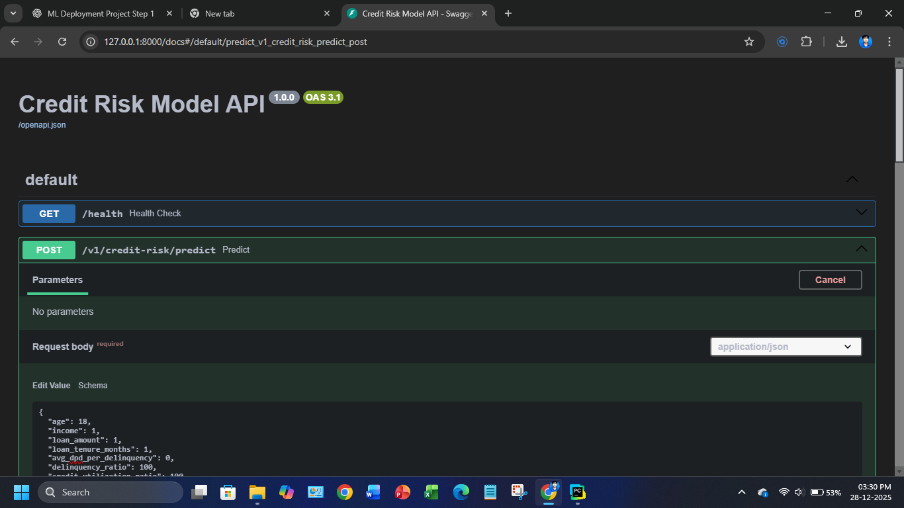

# 📊 Credit Risk Model API (Local Inference Service)

## 1. Project Overview



This repository contains a **production-ready FastAPI inference service** for a trained **Credit Risk Machine Learning model**.

The purpose of this project is to:
- Serve ML predictions via a clean REST API
- Validate inputs strictly
- Ensure deterministic, testable inference
- Act as a **base reference** for future deployment projects

> ⚠️ This repository is intentionally kept **local-only**.  
> Cloud deployment is handled in separate projects.

---

## 2. What This Project Does
- Can be used in any UI - web/desktop/mobile.
- Loads a pre-trained Credit Risk model (`joblib`)
- Accepts structured customer financial data
- Computes:
  - Default probability
  - Credit score (300–900)
  - Risk rating (Poor → Excellent)
- Exposes inference via REST API

---

## 3. What This Project Does NOT Do

- ❌ No UI (Streamlit removed)
- ❌ No model training or retraining
- ❌ No cloud deployment
- ❌ No authentication
- ❌ No CI/CD

These concerns are handled in **separate deployment repositories**.

---

## 4. Tech Stack

- Python 3.10
- FastAPI (API layer)
- Pydantic (request/response validation)
- scikit-learn (model inference)
- NumPy
- Joblib

---

## 5. Project Structure

```
credit-risk-api/
│
├── app/
│   ├── main.py           # FastAPI entrypoint
│   ├── schemas.py        # Pydantic models
│   ├── inference.py      # Pure ML inference logic
│   └── model_loader.py   # Reserved for future startup loading
│
├── artifacts/
│   └── model_data.joblib # Trained model + scaler
│
├── tests/
│   └── test_inference.py # Unit tests
│
├── requirements.txt
└── README.md
```

---

## 6. API Endpoints

### Health Check

GET /health

Response:
```json
{
  "status": "ok"
}
```

---

### Credit Risk Prediction

POST /v1/credit-risk/predict

#### Request Body (JSON)

```json
{
  "age": 30,
  "income": 1200000,
  "loan_amount": 2500000,
  "loan_tenure_months": 36,
  "avg_dpd_per_delinquency": 20,
  "delinquency_ratio": 30,
  "credit_utilization_ratio": 40,
  "num_open_accounts": 2,
  "residence_type": "Owned",
  "loan_purpose": "Home",
  "loan_type": "Unsecured"
}
```

#### Response (JSON)

```json
{
  "default_probability": 0.23,
  "credit_score": 712,
  "rating": "Good"
}
```

---

## 7. Local Setup

### Create virtual environment

```bash
python -m venv .venv
```

Activate:
- Windows:
```bash
.venv\Scripts\activate
```

---

### Install dependencies

```bash
pip install -r requirements.txt
```

---

### Run API locally

```bash
uvicorn app.main:app --reload
```

Swagger UI:
http://127.0.0.1:8000/docs

---

## 8. Testing

Run unit tests from project root:

```bash
python -m pytest
```

---

## 9. Model Compatibility Note

This project uses:
- scikit-learn==1.3.0
- numpy==1.24.3

These versions **match the training environment** and are intentionally pinned to avoid inference drift.

---

## 10. Reuse for Future Deployment Projects

This repository serves as:
- A **local inference reference**
- A **base API contract**
- A **foundation** for:
  - Docker-based deployment
  - AWS / Azure hosting
  - API Management integration
  - Secure client access

Deployment-specific logic is implemented in **separate repositories**.

---

## 11. License / Usage

Internal use only.  
Client deployment handled under separate agreements.


**Author :AI-Solution (Karan kk)** 